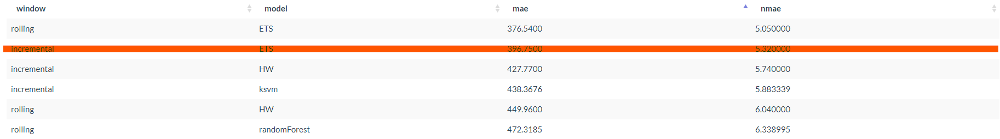
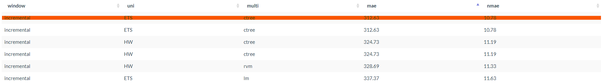

# Best Models

After analysing all the results for our picked models for every scenario and time series, the ones with the least MAE were chosen to be used as the best option in the final solution

For all the scenarios the data was divided in the 5 Time Series <b>All</b>,<b>Female</b>,<b>Male</b>,<b>Young</b> and <b>Adult.</b>

## Scenario 1 (Untouched)
In this scenario we kept all of the columns and values exactly like they were, same columns and same outlier values.

### **All**

For this time series the aproach was the <b>Hybrid Model</b> composed by

Univariate Model: <b>Holt Winters</b>

Multivariate Model: <b>Linear Model</b>

MAE: <b>757.59</b>

NMAE: <b>4.93</b>

### **Female**

For this time series the aproach was the <b>Multivariate Model</b> composed by

Model: <b>ETS</b>

MAE: <b>396.7500</b>

NMAE: <b>5.32</b>

### **Male**

For this time series the aproach was the <b>Hybrid Model</b> composed by

Univariate Model: <b>Holt Winters</b>

Multivariate Model: <b>Linear Model</b>

MAE: <b>413.97</b>

NMAE: <b>6.02</b>

### **Young**

For this time series the aproach was the <b>Multivariate Model</b> composed by

Model: <b>ETS</b>

MAE: <b>409.96</b>

NMAE: <b>5.61</b>

### **Adult**

For this time series the aproach was the <b>Hybrid Model</b> composed by

Univariate Model: <b>Holt Winters</b>

Multivariate Model: <b>Linear Model</b>

MAE: <b>422.62</b>

NMAE: <b>5.25</b>

## Scenario 2 (Without Outliers)
This scenario is supposed to be identical to the first one but without any outlier values for the time series in question, as they have been replaced with the mean value for the time series column.

### **All**

For this time series the aproach was the <b>Hybrid Model</b> composed by

Univariate Model: <b>Holt Winters</b>

Multivariate Model: <b>Conditional Inference Tree</b>

MAE: <b>644.82</b>

NMAE: <b>11.08</b>

### **Female**

For this time series the aproach was the <b>Hybrid Model</b> composed by

Univariate Model: <b>ETS</b>

Multivariate Model: <b>Conditional Inference Tree</b>

MAE: <b>312.63</b>

NMAE: <b>10.78</b>

### **Male**

For this time series the aproach was the <b>Hybrid Model</b> composed by

Univariate Model: <b>Linear Model</b>

Multivariate Model: <b>Linear Model</b>

MAE: <b>405.20</b>

NMAE: <b>16.33</b>

### **Young**

For this time series the aproach was the <b>Hybrid Model</b> composed by

Univariate Model: <b>Linear Model</b>

Multivariate Model: <b>Linear Model</b>

MAE: <b>356.75</b>

NMAE: <b>12.83</b>

### **Adult**

For this time series the aproach was the <b>Univariate Model</b> composed by

Univariate Model: <b>Holt Winters</b>

MAE: <b>360.59</b>

NMAE: <b>11.47</b>

## Scenario 3 (With Holidays)
This scenario counts with an additional column **holiday** that, for each record, has 1 if that day corresponds with a holiday in Portugal, or a 0 if not. This information was extracted from https://holidays.abstractapi.com where everyday was tested via loop cycle and the results stored in this extra column.

### **All**

For this time series the aproach was the <b>Hybrid Model</b> composed by

Univariate Model: <b>Holt Winters</b>

Multivariate Model: <b>Linear Model</b>

MAE: <b>811.93</b>

NMAE: <b>5.29</b>

### **Female**

For this time series the aproach was the <b>Hybrid Model</b> composed by

Univariate Model: <b>Holt Winters</b>

Multivariate Model: <b>Linear Model</b>

MAE: <b>398.71</b>

NMAE: <b>5.35</b>

### **Male**

For this time series the aproach was the <b>Hybrid Model</b> composed by

Univariate Model: <b>Holt Winters</b>

Multivariate Model: <b>Linear Model</b>

MAE: <b>415.31</b>

NMAE: <b>6.04</b>

### **Young**

For this time series the aproach was the <b>Multivariate Model</b> composed by

Univariate Model: <b>ETS</b>

MAE: <b>409.96</b>

NMAE: <b>5.61</b>

### **Adult**

For this time series the aproach was the <b>Hybrid Model</b> composed by

Univariate Model: <b>Linear Model</b>

Multivariate Model: <b>Linear Model</b>

MAE: <b>531.93</b>

NMAE: <b>6.60</b>

