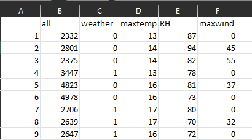
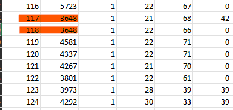
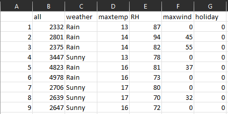

# Scenarios

There were a few ways of preparing the data and doing the pre-processing of the initial dataset, for that reason we thought that dividing this project into multiple scenarios would be the best approach, each one with a different data configuration

For all the scenarios the data was divided in the 5 Time Series <b>All</b>,<b>Female</b>,<b>Male</b>,<b>Young</b> and <b>Adult</b>,

## Scenario 1 (Untouched)
In this scenario we kept all of the columns and values exactly like they were, same columns and same outlier values.

## Scenario 2 (Without Outliers)
This scenario is supposed to be identical to the first one but without any outlier values for the time series in question, as they have been replaced with the mean value for the time series column.

## Scenario 3 (With Holidays)
This scenario counts with an additional column **holiday** that, for each record, has 1 if that day corresponds with a holiday in Portugal, or a 0 if not. This information was extracted from https://holidays.abstractapi.com where everyday was tested via loop cycle and the results stored in this extra column.

